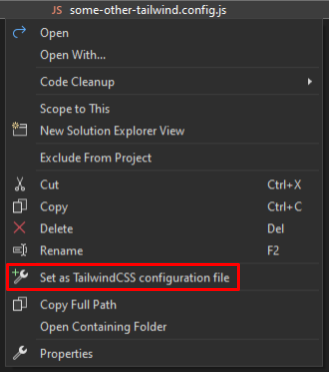
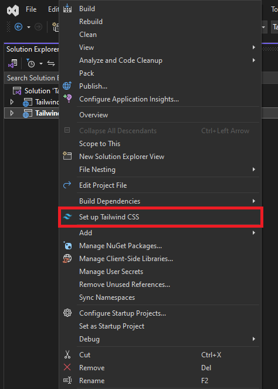
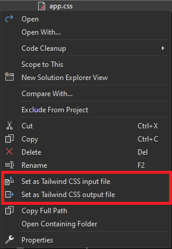
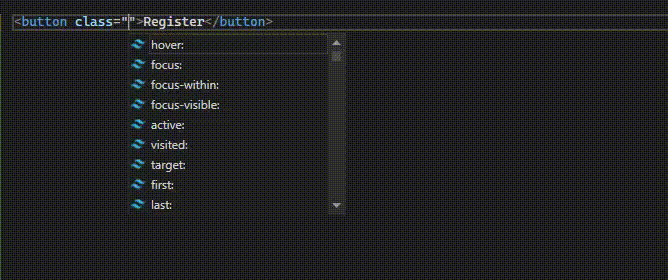
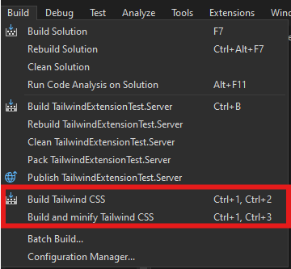

# Getting Started (Tailwind v3.x)

The following guide is for projects using Tailwind v3.x. For Tailwind v4+ projects, use the [Getting Started guide](https://github.com/theron-wang/VS2022-Editor-Support-for-Tailwind-CSS/blob/main/Getting-Started.md).

## Video

If you prefer a video tutorial, [click here](https://www.youtube.com/watch?v=guJgtQHQwPo) to watch CodingWithGreg's YouTube video.

## Existing Projects

1. The extension auto-detects `tailwind.config.{js,cjs,mjs,ts,cts,mts}` files in your solution.
   To set manually, right-click the file → **Set as Tailwind CSS configuration file**.  
   Features are only enabled when a config file is found or set.

   **If using a TypeScript file, ensure you have `tsc` installed globally (`npm install -g typescript`).**

   

## New Projects

1. Right-click the project in the Solution Explorer → **Set up Tailwind CSS**:  
   - Installs `tailwindcss`, if needed
   - Creates `tailwind.config.js`

   

2. Using the standalone Tailwind CSS CLI:
   - Set path: Tools > Options > Tailwind CSS IntelliSense > Tailwind CLI path  
   - Then use **Set up Tailwind CSS (use CLI)** 
   - Toggle CLI usage via `UseCli` in `tailwind.extension.json`

3. Theme setup: follow the [official guide](https://v3.tailwindcss.com/docs/installation).

## Setting Up the Extension

1. The default output is `{input}.output.css`, which can be set in global extension settings (see below).

   To change it, right-click the file → **Link as Tailwind CSS output file** and pick a config.

   

2. IntelliSense works in `.html`, `.css`, `.cshtml`, `.razor`, etc.
   Configuration contexts are based on [Tailwind's file detection](https://v3.tailwindcss.com/docs/content-configuration).

   

3. Tailwind builds automatically on project build, or manually via **Build > Build Tailwind CSS**.

   

## Extension Configuration
Settings for this extension can be updated in **Tools > Options > Tailwind CSS IntelliSense**.

| Setting | Category | Description | Default Value |
| --- | --- | --- | --- |
| Enable extension | General | Enables/disables the extension globally | `true` |
| Automatically apply library updates | General | `tailwindcss` updates on project open. The extension works best with the most recent update of each major version, so this setting is recommended. | `true` |
| Show color previews | General | Color previews for color classes | `true` |
| Minify builds | Build | Use of `--minify` when building | `false` |
| Default output file name | Build | Output file name template to be used when not specificially specified. Use `{0}` to reference the original input file's name. | `{0}.output.css` |
| Build type | Build | <ul><li>`Default`: Tailwind `--watch`, on project build</li><li>`Manual`: once, Ctrl+1, Ctrl+1/2/3</li><li>`OnBuild`: once, on project build</li><li>`OnSave`: once, on file save</li><li>`ManualJIT`: Tailwind `--watch`, Ctrl+1, Ctrl+2/3</li><li>`None`</li></ul> | `Default` |
| OnSave trigger: file extensions | Build | File extensions which will trigger the OnSave build event. Only takes effect when \"Build type\" is set to OnSave. | `.css;.html;.cshtml;.razor;.js` |
| Tailwind CLI path | Build | The path to the standalone Tailwind CLI. If `UseCli` is set to `true` in a project, building will use this file instead of `npx`. | |
| Verbose build | Build | Shows full build log | `false` |
| Build script | Custom Build | The name of the script to execute on build (defined in package.json), optional | |
| Override build | Custom Build | Run the script defined in "Build script" exclusively or in conjunction with the default build process | `false` |
| Tailwind CSS completions before all | Completions | Tailwind completions show up before or after default completions | `true` |
| Class sort type | Class Sort | <ul><li>`OnSave`: sort open file on save</li><li>`OnBuild`: sort updated files in the entire solution on build</li><li>`Manual`: sort through Tools > Sort Tailwind classes</li><li>`None`</li></ul> | `OnSave` |

### Linter options

| Setting | Category | Description | Default Value |
| --- | --- | --- | --- |
| Enable linter | Linter | Enables/disables the linter | `true` |
| Invalid screen | Linter | Unknown screen name used with the `@screen` directive. | `Error` |
| Invalid Tailwind directive | Linter | Unknown value used with the `@tailwind` directive. | `Error` |
| Invalid config path | Linter | Unknown or invalid path used with the theme helper. | `Error` |
| CSS conflict | Linter | Class names on the same HTML element / CSS class which apply the same CSS property or properties. | `Warning` |

### `tailwind.extension.json` Customization

- **`ConfigurationFiles`**: List of relative configuration file paths
  - **`Path`**: The relative path to the configuration file
- **`BuildFiles`**: List of relative input file paths to build with the project.
  - **`Input`**: Input CSS file (one output per input).
  - **`Output`**: Output CSS file.
  - **`Behavior`**: How the input file should be built; `Default` uses global extension settings (valid values: `Default`, `Minified`, `Unminified`)
- **`PackageConfigurationFile`**: Relative path to `package.json`, used to determine custom build scripts defined in extension settings.
- **`UseCli`**: If `true`, uses the Tailwind CLI (if installed and configured) instead of `npx @tailwindcss/cli`.
- **`CustomRegexes`**: Custom regexes for completions, sorting, linting, etc., with separate options for Razor, HTML, and JS.
  - **`Override`**: If `true`, ignores default regexes.
  - **`Values`**: Priority-ordered list of regexes per context.
  - **Notes**:
    - Must use valid C# regex syntax.
    - Regex must include a `content` capture group (e.g., `class="(?<content>.*)"`).
    - Custom regexes may override defaults.
    - Test thoroughly to avoid unintended behavior from overly general or overlapping patterns.

### Sample file

```json
{
  "$schema": "https://raw.githubusercontent.com/theron-wang/VS2022-Editor-Support-for-Tailwind-CSS/refs/heads/main/tailwind.extension.schema.json",
  "ConfigurationFiles": [
    {
        "Path": "..\\Client\\tailwind.config.js"
    },
    {
        "Path": "tailwind.config.js"
    }
  ],
  "BuildFiles": [
    {
      "Input": "site.css",
      "Output": "wwwroot\\css\\site.output.css",
      "Behavior": "Default"
    },
    {
      "Input": "Components\\App.razor.tailwind.css",
      "Output": "Components\\App.razor.css",
      "Behavior": "Minified"
    }
  ],
  "PackageConfigurationFile": "package.json",
  "UseCli": false,
  "CustomRegexes": {
    "Razor": {
      "Override": false,
      "Values": [
        "your regex"
      ]
    },
    "HTML": {
      "Override": false,
      "Values": []
    },
    "JavaScript": {
      "Override": true,
      "Values": [
        "your regex"
      ]
    }
  }
}
```
