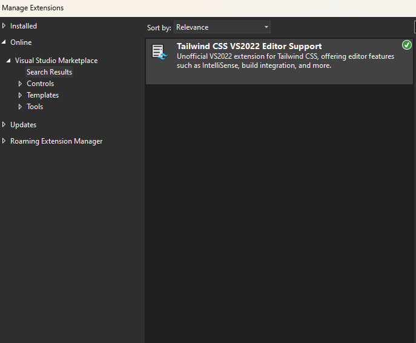

# Getting Started

## Video

If you prefer a video tutorial, [click here](https://www.youtube.com/watch?v=guJgtQHQwPo) to watch CodingWithGreg's YouTube video.

## Installation

1. Download from the [Visual Studio Marketplace](https://marketplace.visualstudio.com/items?itemName=TheronWang.TailwindCSSIntellisense) or directly from the IDE.

- If you are downloading from the IDE, open Extensions > Manage Extensions and search up 'Tailwind'.



**IMPORTANT**: This extension uses `npm` and `node` for various purposes--follow the [official guide](https://docs.npmjs.com/downloading-and-installing-node-js-and-npm) if you do not already have it installed.

## Existing Projects

2. The extension will automatically try to find a `tailwind.config.js` in your solution. If it is not found, however, you can manually set it by right-clicking your file and selecting 'Set as Tailwind CSS configuration file'.


## New Project

2a. Once you have created a project, right click on the project node and click 'Set up Tailwind CSS':


This will import the Tailwind CSS node modules and configure your `tailwind.config.js`.

2b. To configure Tailwind CSS, follow the [official documentation](https://tailwindcss.com/docs/installation) (specifically steps 2, 3, and 5).

- Include the following in your input css file:
```css
@tailwind base;
@tailwind components;
@tailwind utilities;
```
- Ensure your `tailwind.config.js` has a valid `content` value (e.g. `["./**/*.{html,cshtml,razor,js}"]`)

## Setting Up the Extension

3. Before you are ready to build, set your input CSS file. Your output file will automatically be generated as `{input file name}.output.css`. If you want to specify a certain file, you can right click and click 'Set as Tailwind CSS output file'.


4. IntelliSense will display once you type in any HTML or CSS files, including `.html`, `.css`, `.cshtml`, `.razor` files and more.


5. To build your file, either manually start the build process under Build > Build Tailwind CSS.


Settings for this extension can be updated in Tools > Options > Tailwind CSS IntelliSense.