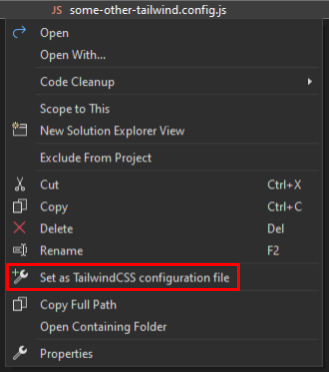
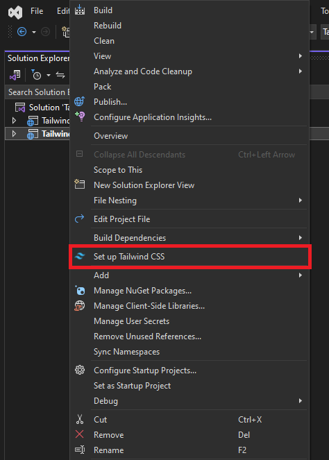
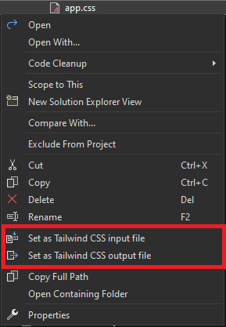
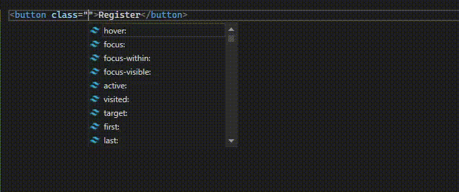
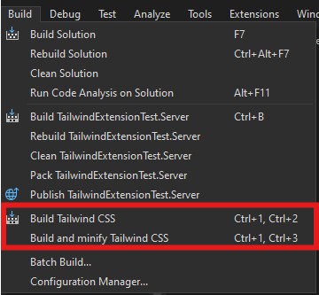

# Getting Started (Tailwind v4+)

This guide is for projects using Tailwind v4 and above. For Tailwind v3 projects, use the [v3 Getting Started guide](https://github.com/theron-wang/Tailwind-CSS-for-Visual-Studio/blob/main/Getting-Started-v3.md).

## Video

For a quick walkthrough, watch the [Getting Started video guide](https://www.youtube.com/watch?v=TZ_c424SIRc).

## Existing Projects

1. The extension automatically detects CSS files that contain `@import "tailwindcss"`.  
   If needed, right-click the file and select **Set as Tailwind CSS configuration file**.  
   Features are enabled only after a configuration file is detected or set manually.

   

## New Projects

1. Right-click the project in Solution Explorer and select **Set up Tailwind CSS**:
   - Installs `tailwindcss` and `@tailwindcss/cli` if needed
   - Creates `tailwind.css` with `@import "tailwindcss"`

   

2. If you use the standalone Tailwind CSS CLI:
   - Set the path in Tools > Options > Tailwind CSS IntelliSense > Tailwind CLI path  
   - Then use **Set up Tailwind CSS (use CLI)**  
   - Toggle CLI usage with `UseCli` in `tailwind.extension.json`

3. For theme setup, follow the [official guide](https://tailwindcss.com/docs/installation/tailwind-cli).
  
   For simple files with no theme values:

   ```css
   @import "tailwindcss";
   ```

   If your project root is different from the folder containing your input CSS file:

   ```css
   @import "tailwindcss" source("../path/to/source");
   ```

## Setting Up the Extension

1. The default output is `{input}.output.css`, which can be changed in the global extension settings.

   To change it, right-click the file and select **Link as Tailwind CSS output file**.

   

2. IntelliSense works in `.html`, `.css`, `.cshtml`, `.razor`, and similar files.
   Configuration contexts follow [Tailwind's file detection](https://tailwindcss.com/docs/detecting-classes-in-source-files).

   

3. Tailwind builds automatically when the project builds, or manually via **Build > Build Tailwind CSS**.

   

## Extension Configuration
Settings for this extension can be updated in **Tools > Options > Tailwind CSS IntelliSense**.
  
| Setting | Category | Description | Default Value |
| --- | --- | --- | --- |
| Enable extension | General | Enables/disables the extension globally | `true` |
| Automatically apply library updates | General | `tailwindcss` and `@tailwindcss/cli` update on project open. The extension works best with the most recent update of each major version, so this setting is recommended. | `true` |
| Show color previews | General | Color previews for color classes | `true` |
| Minify builds | Build | Use of `--minify` when building | `false` |
| Default output file name | Build | Output file name template used when not specifically specified. Use `{0}` to reference the original input file name. | `{0}.output.css` |
| Build type | Build | <ul><li>`Default`: Tailwind `--watch`, on project build</li><li>`Manual`: once, Ctrl+1, Ctrl+2/3</li><li>`OnBuild`: once, on project build</li><li>`OnSave`: once, on file save</li><li>`ManualJIT`: Tailwind `--watch`, Ctrl+1, Ctrl+1/2/3</li><li>`None`</li></ul> | `Default` |
| OnSave trigger: file extensions | Build | File extensions that trigger the OnSave build event. Only takes effect when "Build type" is set to OnSave. | `.css;.html;.cshtml;.razor;.js` |
| Tailwind CLI path | Build | The path to the standalone Tailwind CLI. If `UseCli` is set to `true` in a project, building uses this file instead of `npx`. | |
| Verbose build | Build | Shows full build log | `false` |
| Build script | Custom Build | The name of the script to execute on build (defined in package.json), optional | |
| Override build | Custom Build | Run the script defined in "Build script" exclusively or together with the default build process | `false` |
| Tailwind CSS completions before all | Completions | Tailwind completions show up before or after default completions | `true` |
| Class sort type | Class Sort | <ul><li>`OnSave`: sort open file on save</li><li>`OnBuild`: sort updated files in the entire solution on build</li><li>`Manual`: sort through Tools > Sort Tailwind classes</li><li>`None`</li></ul> | `OnSave` |
  
### Linter options

| Setting | Category | Description | Default Value |
| --- | --- | --- | --- |
| Enable linter | Linter | Enables/disables the linter | `true` |
| Invalid screen | Linter | Unknown screen name used with the `@screen` directive. | `Error` |
| Invalid Tailwind directive | Linter | Unknown value used with the `@tailwind` directive. | `Error` |
| Invalid config path | Linter | Unknown or invalid path used with the theme helper. | `Error` |
| CSS conflict | Linter | Class names on the same HTML element / CSS class which apply the same CSS property or properties. | `Warning` |

### `tailwind.extension.json` Customization

- **`BuildFiles`**: List of relative input file paths to build with the project.
  - **`Input`**: Input CSS file (one output per input).
  - **`Output`**: Output CSS file.
  - **`Behavior`**: How the input file should be built; `Default` uses global extension settings (valid values: `Default`, `Minified`, `Unminified`)
- **`PackageConfigurationFile`**: Relative path to `package.json`, used to determine custom build scripts defined in extension settings.
- **`UseCli`**: If `true`, uses the Tailwind CLI (if installed and configured) instead of `npx @tailwindcss/cli`.
- **`CustomRegexes`**: Custom regexes for completions, sorting, linting, etc., with separate options for Razor, HTML, and JS.
  - **`Override`**: If `true`, ignores default regexes.
  - **`Values`**: Priority-ordered list of regexes per context.
  - **Notes**:
    - Must use valid C# regex syntax.
    - Regex must include a `content` capture group (e.g., `class="(?<content>.*)"`).
    - Custom regexes may override defaults.
    - Test thoroughly to avoid unintended behavior from overly general or overlapping patterns.

### Sample file

```json
{
  "$schema": "https://raw.githubusercontent.com/theron-wang/Tailwind-CSS-for-Visual-Studio/refs/heads/main/tailwind.extension.schema.json",
  "BuildFiles": [
    {
      "Input": "..\\Client\\tailwind.css",
      "Output": "..\\Client\\tailwind.output.css",
      "Behavior": "Default"
    },
    {
      "Input": "tailwind.css",
      "Output": "tailwind.min.css",
      "Behavior": "Minified"
    }
  ],
  "PackageConfigurationFile": "package.json",
  "UseCli": false,
  "CustomRegexes": {
    "Razor": {
      "Override": false,
      "Values": [
        "your regex"
      ]
    },
    "HTML": {
      "Override": false,
      "Values": []
    },
    "JavaScript": {
      "Override": true,
      "Values": [
        "your regex"
      ]
    }
  }
}
```