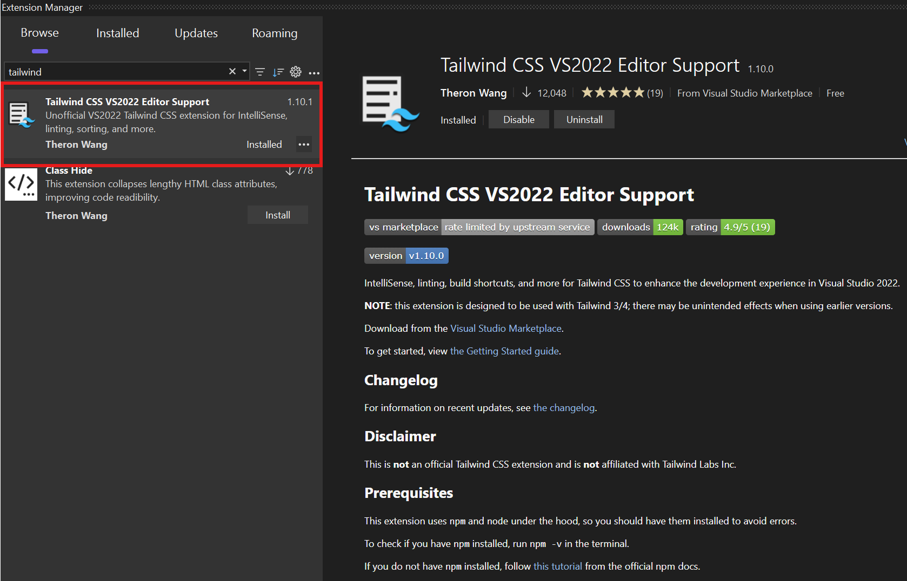

# Getting Started

## Video

If you prefer a video tutorial, [click here](https://www.youtube.com/watch?v=guJgtQHQwPo) to watch CodingWithGreg's YouTube video.

## Installation

1. Download from the [Visual Studio Marketplace](https://marketplace.visualstudio.com/items?itemName=TheronWang.TailwindCSSIntellisense) or directly from the IDE.

	- If you are downloading from the IDE, open Extensions > Manage Extensions and search up 'Tailwind'.

	

	**IMPORTANT**: This extension uses `npm` and `node` for various purposes--follow the [official guide](https://docs.npmjs.com/downloading-and-installing-node-js-and-npm) if you do not already have it installed.

## Existing Projects

2. The extension will automatically try to find a `tailwind.config.js` in your solution. If it is not found, however, you can manually set it by **right-clicking your file and selecting 'Set as Tailwind CSS configuration file'**.

	**Extension features will only be enabled if a configuration file is found.**

	

## New Project

2a.	Once you have created a project, **right click on the project node and click 'Set up and install Tailwind CSS'**:


This will import the Tailwind CSS node modules and configure your `tailwind.config.js`.

**Using the standalone Tailwind CSS CLI:**
- If you have the Tailwind CSS CLI installed, you can click 'Set up Tailwind CSS (use CLI)' instead once you have specified the CLI path in Tools > Options > Tailwind CSS IntelliSense > Tailwind CLI path.
- Following builds in the project will use the Tailwind CLI instead of `npx tailwindcss`
- If you want to switch between `npx tailwindcss` and the standalone CLI, adjust the `UseCli` property in `tailwind.extension.json`

2b. To configure Tailwind CSS, follow the [official documentation](https://tailwindcss.com/docs/installation) (specifically steps 2, 3, and 5).

- Include the following in your input css file:
```css
@tailwind base;
@tailwind components;
@tailwind utilities;
```
- Ensure your `tailwind.config.js` has a valid `content` value (e.g. `["./**/*.{html,cshtml,razor,js}"]`)

## Setting Up the Extension

3. Before you are ready to build, **set your input CSS file**. Your output file will automatically be generated as `{input file name}.output.css`. If you want to specify a certain file, you can right click and click 'Link as Tailwind CSS output file' and select the corresponding input file. **Input files must already be defined prior to selecting an output file.**


4. IntelliSense will display once you type in any HTML or CSS files, including `.html`, `.css`, `.cshtml`, `.razor` files and more, **as long as there is either a `tailwind.config.js` file or another configuration file specified**.


5. **Your Tailwind file will automatically build on project build**, but you can also manually start the build process under Build > Build Tailwind CSS.


6. **Settings for this extension can be updated in Tools > Options > Tailwind CSS IntelliSense.**

## Customizing Your `tailwind.extension.json` File

- `ConfigurationFile`: The relative path to your configuration file (i.e. `tailwind.config.js`). This will be parsed for IntelliSense purposes.
- `BuildFiles`: A list of files (relative paths) to build when the project is built. This is useful if you have multiple CSS files that need to be built.
    - `Input`: The input css file. Each input file may only have one output file.
	- `Output`: The output css file.
- `PackageConfigurationFile`: The relative path to your `package.json` file. This is used to determine if a custom build should be used, if you defined an npm script to run in the extension's settings.
- `UseCli`: Whether to use the Tailwind CLI or `npx tailwindcss` for building. If you have the Tailwind CLI installed and you have defined its location in the extension's settings, you can set this to `true` to use it instead.
- `CustomRegexes`: Extra regexes to use for completion contexts, sorting, linting, etc., allowing separate options for Razor, HTML, and JS contexts.
	- `Override`: Whether to override the default regexes. If set to `true`, the extension's default regexes will be ignored.
	- `Values`: A list of regexes, in order of priority, to use for each context.
	- **Important notes**:
		- Regexes may use any valid C# engine regex syntax.
		- Your class content must be located in the `content` capture group. For example, the regex `class="(?<content>.*)"` successfully captures `content`.
		- Custom regexes take precedence over default functionality; that is, if a context is matched in both your custom regex and the original regex, the custom regex will be used.
		- It's recommended to thoroughly test your regexes before adding it into your options. Unintended behavior may occur if the regex is too general or if it overlaps with existing functionality.

Sample file:
```json
{
	"ConfigurationFile": "tailwind.config.js",
	"BuildFiles": [
		{
			"Input": "site.css",
			"Output": "wwwroot/css/site.output.css"
		},
		{
			"Input": "Components/App.razor.tailwind.css",
			"Output": "Components/App.razor.css"
		}
	],
	"PackageConfigurationFile": "package.json",
	"UseCli": false,
	"CustomRegexes": {
		"Razor": {
			"Override": false,
			"Values": [
				"your regex"
			]
		},
		"HTML": {
			"Override": false,
			"Values": []
		},
		"JavaScript": {
			"Override": true,
			"Values": [
				"your regex"
			]
		}
	}
}
```